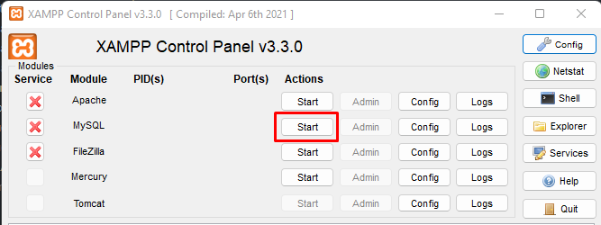

# SIIT Baan Sorting Program

This program is a Baan Sorting Program for SIIT students. It uses Python to connect to the database (MySQL) and uses Google Cloud's API to connect to Google Sheets to retrieve, write, and update data.

## Features

- Gets student data from Google Sheets and put them into the database
- Randoms a Baan for each student group and save the data to the database
- Puts the group (list of students in that group) into the Baan's sheet in Google Sheets automatically

## Table of Contents

- [SIIT Baan Sorting Program](#siit-baan-sorting-program)
  - [Features](#features)
  - [Table of Contents](#table-of-contents)
  - [Setup and Requirements](#setup-and-requirements)
    - [Local Database](#local-database)
    - [Google Service Account](#google-service-account)
    - [Google Sheets](#google-sheets)
      - [**Main** Sheet Columns:](#main-sheet-columns)
      - ["บ้าน X" Sheets for each Baan](#บ้าน-x-sheets-for-each-baan)
  - [Install from package](#install-from-package)
  - [Install from source](#install-from-source)
  - [Configurations](#configurations)
    - [worksheetName](#worksheetname)
    - [sheetName](#sheetname)
    - [serviceAccount](#serviceaccount)
    - [Theme and Colors](#theme-and-colors)
    - [Program Icon](#program-icon)

## Setup and Requirements

### Local Database

You would first need to install [XAMPP](https://www.apachefriends.org/).\
After installing, run the **_MySQL_** server by pressing the **_Start_**

### Google Service Account

This program connects to Google Sheets and read/write data through Google's API. So, you would need a _service_account_ file (typically in _json_) the credentials for the program. To get a service account file:

1. Go to [Google Cloud Console](https://console.cloud.google.com/)
2. Create a new project
3. Activate the Google Sheets API, and create a new service account (in the _Credentials_ tab)
4. A **_json_** file will be downloaded. **DO NOT** lose that file since you will need it for the program.
5. After creating the service account, there will be an e-mail of that service account. Save that e-mail as well since you will need to share your Google Sheets to that e-mail account.

### Google Sheets

1. Since this program connects to Google Sheets, you will need to create a Google Sheets in this format:

#### **Main** Sheet Columns:

The names do not need to be exact, **but the order is important!**

| Group No. | Name - Surname | Nickname | Sex | Line ID | Phone Number | Blood Type | Food Allergies | Dietary Restrictions | Drug Allergy | Other things that are allergic, such as allergy to powder, dust, etc. | Congenital diseases | Size | Emergency call |
| --------- | -------------- | -------- | --- | ------- | ------------ | ---------- | -------------- | -------------------- | ------------ | --------------------------------------------------------------------- | ------------------- | ---- | -------------- |
|           |                |          |     |         |              |            |                |                      |              |                                                                       |                     |      |                |

#### "บ้าน X" Sheets for each Baan

The sheet for each Baan should have the same columns as the `Main` sheet and named as `บ้าน X`

2. Share the Google Sheets to the Service Account e-mail

## Install from package

Packages for Windows and macOS are found on the [Releases](https://github.com/nutchanon-c/siit_baan_sorting/releases) page.

1. Download the file according to your operating system
2. Extract the files to a folder
3. Put the service account json file in the same folder as the program.\
   
4. Make sure MySQL server in XAMPP has been started.
5. Run the executable file
   1. For Windows users: Just open the `.exe` file
   2. For macOS users:
      1. execute the file using the command: `{path_to_program}/baan_sorting_program` or double click to open the one without an icon image and wait a bit for the program to load

## Install from source

If you want to install/run the program using python rather than the package.

1. Download the source code
2. Install all the packages by running the following command in terminal\
   on Windows\
   `pip freeze | %{$_.split('==')[0]} | %{pip install --upgrade $_}`

   on Linux\
   `pip3 list --outdated --format=freeze | grep -v '^\-e' | cut -d = -f 1 | xargs -n1 pip3 install -U `\
   [_Reference_](https://www.activestate.com/resources/quick-reads/how-to-update-all-python-packages/)

3. Put the service account json file in the same folder as the program.\
   
4. Make sure MySQL server in XAMPP has been started.
5. Run the program: `baan_sorting_program.py`

## Configurations

The configurations of the program can be changed in the `config.json` file in the program directory. Open the file with your preferred text editor (e.g. Notepad, [VS Code](https://code.visualstudio.com/), etc.). There are a few configurations you can do to this program. Each configuration field/value is listed below:

### worksheetName

This is the name of the Google Sheets that the program will be using. Change this to the name of the Google Sheets you are using. The default name is **_รายชื่อกลุ่มน้องกิจกรรมเอสไอไทบ้าน_**

### sheetName

This is the name of the "Main" sheet in your Google Sheets. Again, set it according to what you have. The default name is **_Main_**

### serviceAccount

This is the name of your service account json file. In case the name is different, you can change it in the config file. The default name is **_service_account.json_**

### Theme and Colors

All color codes must be provided in hexcode format. For example `#ffe90a`

- backgroundColor
  - This is the color of the program background
- textColor
  - This is the color of the text in the program
- labelColor
  - This is the color of labels in the program

### Program Icon

To change the icon of the program, simply replace the **_icon.ico_** file to the desired icon **in .ico format**
